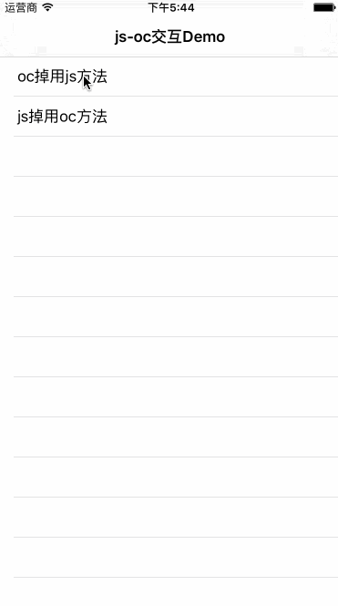

# JSOCInteraction
利用JavaScriptCore实现的JS与OC交互的工具



## Authors
JSOCInteraction is brought to you by [GCZ](https://github.com/GongChuanZan)

## Installation with CocoaPods

[CocoaPods](http://cocoapods.org) 是Objective-C的依赖管理工具, 自动化和简化使用第三方库. 你可以用下面的命令安装它:

```bash
$ gem install cocoapods
```

#### Podfile

使用CocoaPods将JSOCInteraction加入您的Xcode项目,需编辑`Podfile`:

```ruby
source 'https://github.com/CocoaPods/Specs.git'
platform :ios, '8.0'

pod 'JSOCInteraction', '~> 0.0.3'
```

然后，运行以下命令:

```bash
$ pod install
```

## Usage
> JSOCInteraction类下的所有函数需在webView加载完毕后调用有效.

#### Objective-C call Javascript method

```objective-c
NSString *alertJS=@"test()"; //准备执行的js代码

[JSOCInteraction OCCallJSWebView:_webView methods:@[alertJS] callBack:^(BOOL success, NSError *error) {
}];
```

#### Javascript call Objective-C method

```objective-c
[JSOCInteraction JSCallOCWebView:webView methods:@[@"callOC"] callBack:^(NSString *method, NSArray *params) {
}];
```

#### Javascript call Objective-C class method

```objective-c
@protocol JSObjectProtocol <JSExport>
- (NSString *)getVersion; // 这里的函数可根据JS内的调用函数去定义，如果函数多个可在这里添加
@end

@interface JSObject : NSObject <JSObjectProtocol>
@end

@implementation JSObject
- (NSString *)getVersion{return @"1.0.0";}
@end

[JSOCInteraction JSCallClassWebView:webView name:@"mApplication" toObject:[JSObject new]];
```

## Technical Support(QQ Group)
♨️331988014

## Features
Use the `JavaScriptCore.framework` to implement this function


